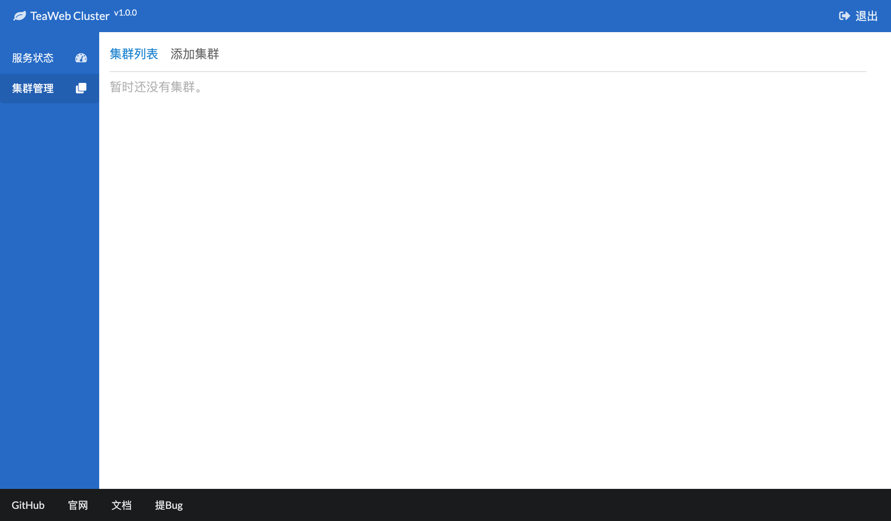
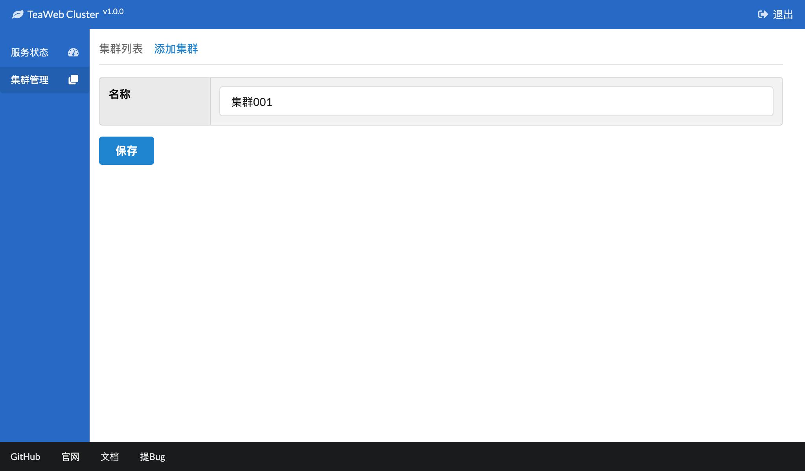
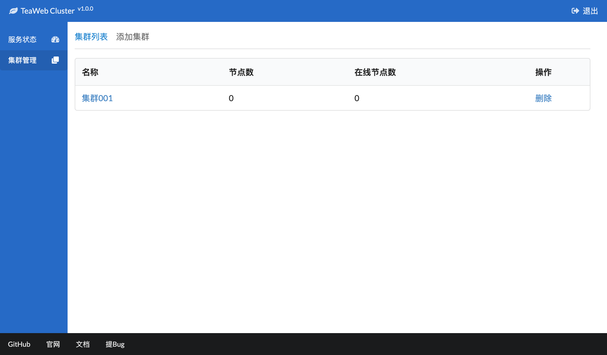
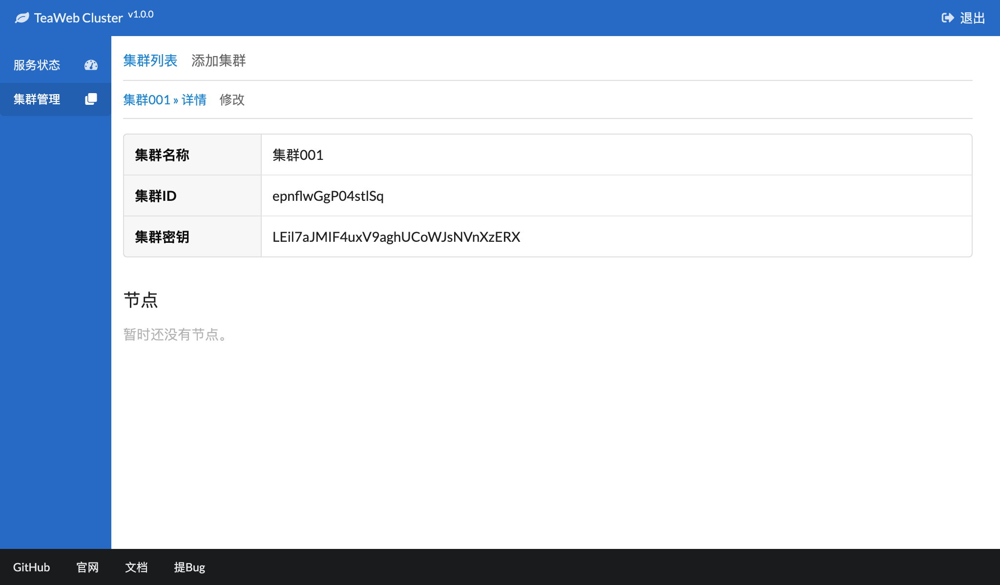
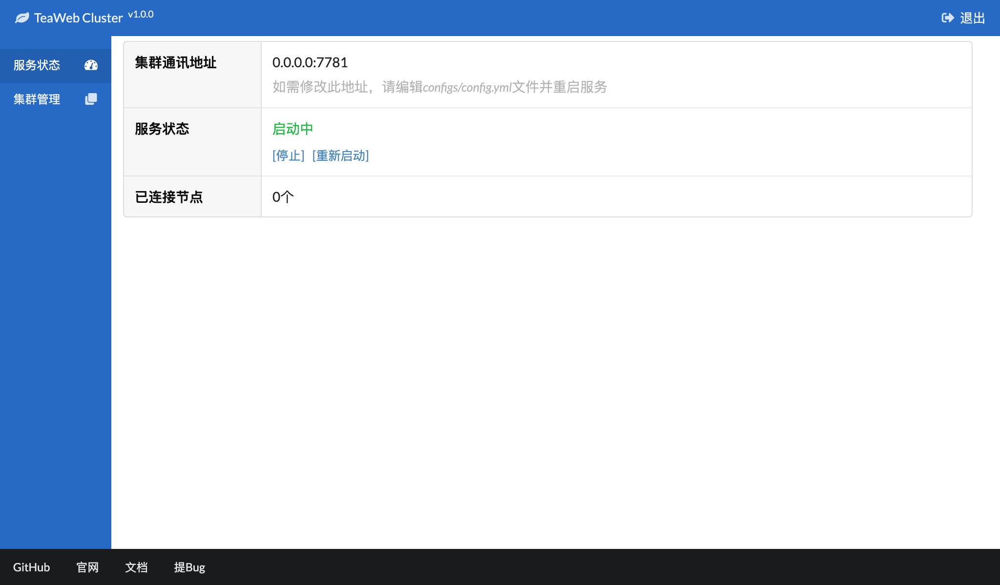

# 集群设置
在要使用集群之前需要先添加一个集群，登录控制台管理界面后可以在"集群管理"里添加一个新的集群。

点击左侧菜单的"集群管理"进入集群管理页面：

点击"添加集群"：

在其中输入集群的名称，没有特殊的限制，只要容易识别即可，然后点击"保存"后跳回到集群管理页面：

这样我们的集群就已经建好了，不需要任何额外的配置。

在集群列表里点击集群的名称，即可查看集群详情：

其中的集群ID、集群密钥会在我们[设置节点](Node.md)时用到。

## 服务状态
需要确保在"服务状态"页面中的服务状态是启动中，这样我们在添加节点时才能正常使用：

## 集群状态
设置好主节点和从节点后，可以在集群控制台上查看所有节点状态：

