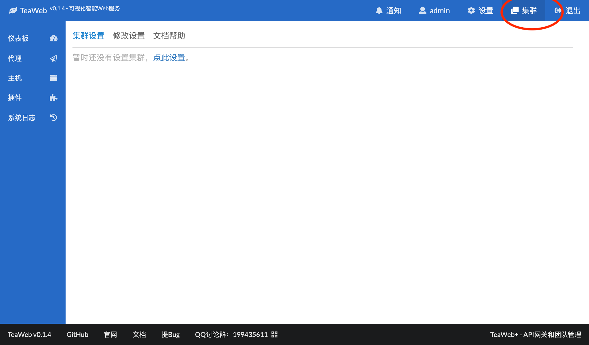
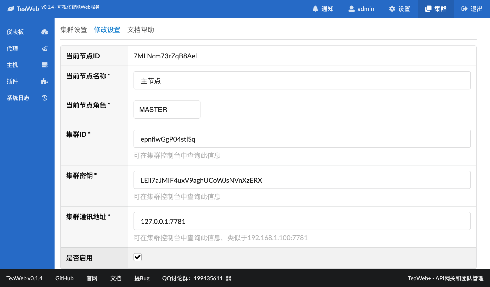
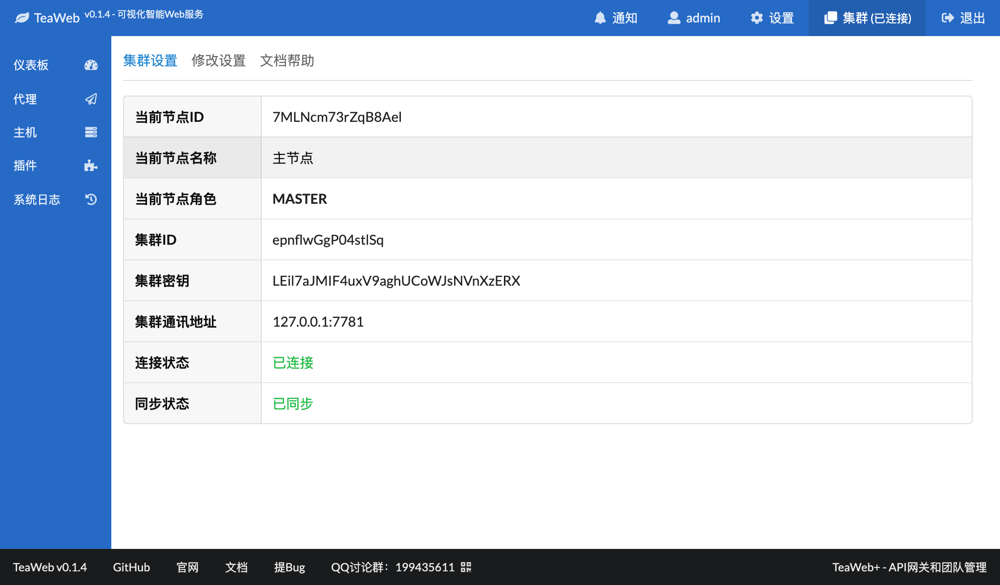
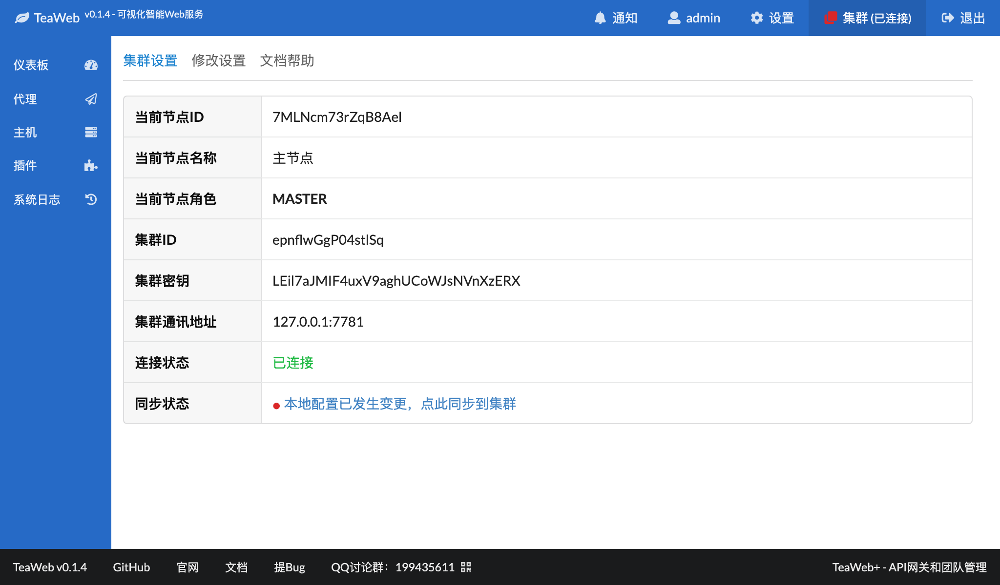
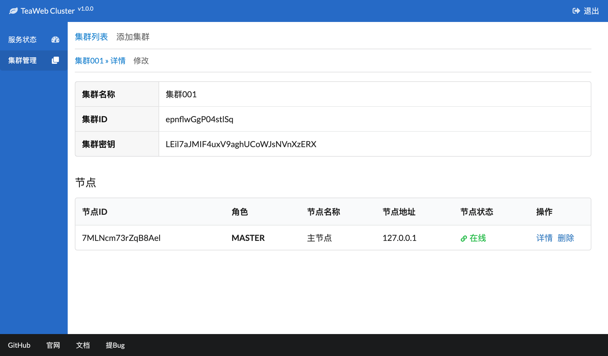

# 节点设置
如果我们已经[安装](Install.md)并[配置](Config.md)好了集群，就可以添加节点了。

每个节点都是一个`TeaWeb`实例，需要版本在v0.1.4以上才能使用。

## 配置集群
点击界面右上角的"集群"：

如果还没有设置集群，则可以点击"修改设置"：

其中：
* `当前节点名称` - 可以任意输入，只要容易识别即可；
* `当前节点角色` - 可以选 `MASTER`（主节点） 或者 `SLAVE`（从节点），这里因为我们添加的是第一个节点，所以选择了主节点；同一个集群中有且只能有一个主节点，其余的都要选择为从节点； 
* `集群ID` - 可以在[集群控制台](Config.md)的集群详情中查看；
* `集群密钥` - 可以在[集群控制台](Config.md)中的集群详情中查看；
* `集群通讯地址` - 可以在[集群控制台](Config.md)中的服务状态中查看，记得在设置节点的时候需要把IP换成实际能够访问的IP或主机名、端口；

设置好了，点击"保存"，即可查看节点状态：

如果连接状态显示"已连接"说明节点连接正确，否则会提示相关的错误信息。

## 配置从节点集群
如果是从节点，需要集群的修改设置中将"当前节点角色"选择为"SLAVE"。 

## 同步配置
主节点如果配置有了变更，界面右上角集群图表会变红，并在集群信息页面提示"本地配置已发生变更，点此同步到集群":

在连接正常的情况下，点击同步到集群即可完成同步。

## 查看集群整体状态
设置好主节点和从节点后，可以在集群控制台上查看所有节点状态：

## 重新设置主节点
要想设置新的主节点，可以先把旧的主节点修改为从节点或者在集群控制台上删除主节点，然后再添加新的主节点即可。