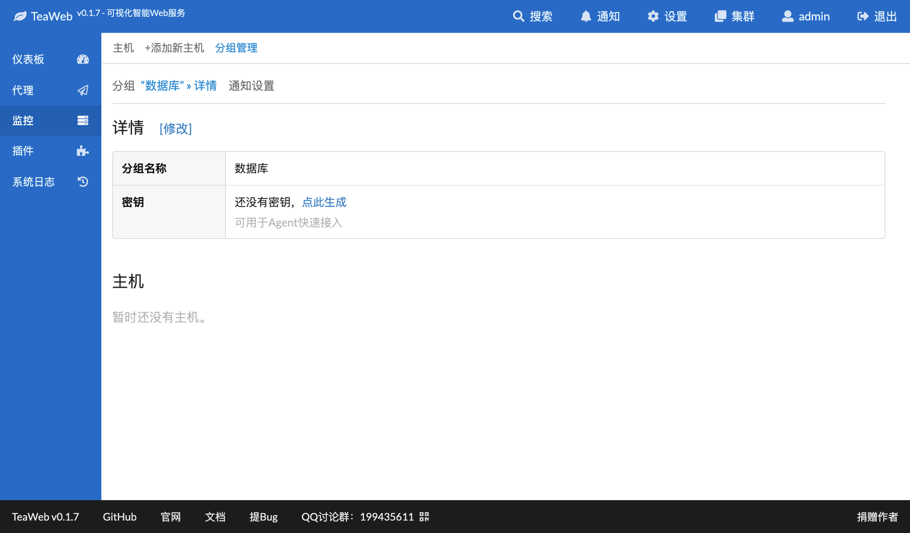
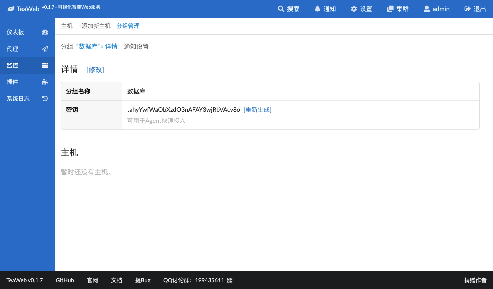

# 通过Group Key安装Agent
从v0.1.7开始，可以通过Group的密钥来自动注册安装的Agent。

## 步骤1：查看分组的Key
在"分组管理"中点击某个分组的详情：

如果"密钥"栏显示还没有密钥，可以点击"点此生成"生成一个密钥。

有密钥的情况如下图所示：

## 步骤2：下载并部署Agent
在 [http://teaos.cn/download](http://teaos.cn/download) 下载对应平台的Agent版本，解压后用编辑器打开`configs/agent.conf`，然后修改里面的内容：
* `master` - 可以访问到Master的地址，需要带有`http://`或者`https://`；如果有必要，需要设置`iptables`或`firewall`；
* `group` - 步骤1生成的密钥

类似于：
~~~yaml
master: http://127.0.0.1:7777           # TeaWeb access address
id: AgentID                             # Agent ID
key: AgentKey                           # Agent Key
group: tahyYwfWaObXzdO3nAFAY3wjRbVAcv8o                         # Group Key
~~~
可以注意到，只需要设置`master`和`group`即可。

**Windows用户注意** 如果你是用Windows上的记事本打开的配置文件，可能会遇到换行符不见而导致无法解析配置的问题，所以建议用别的编辑器打开。

### 使用命令自动初始化配置
从v0.1.8开始，可以使用使用命令自动初始化配置：
~~~bash
bin/teaweb-agent init -master=http://192.168.1.100:7777 -group=tahyYwfWaObXzdO3nAFAY3wjRbVAcv8o
~~~
其中：
* `master` - 可以访问到Master的地址，需要带有`http://`或者`https://`；如果有必要，需要设置`iptables`或`firewall`；
* `group` - 步骤1生成的密钥

这个命令可以自动注册一个新的Agent，并将配置写入到`configs/agent.conf`中，无需自己再手工修改配置文件。

## 测试
使用以下脚本测试连接：
~~~bash
bin/teaweb-agent test
~~~

## 启动
如果测试后同Master的连接没有错误，则可以启动Agent：
~~~bash
bin/teaweb-agent start
~~~

## 更多命令和开机启动
可以参考 [通过ID和Key安装Agent](InstallIdKey.md#更多命令) 一节相关内容。