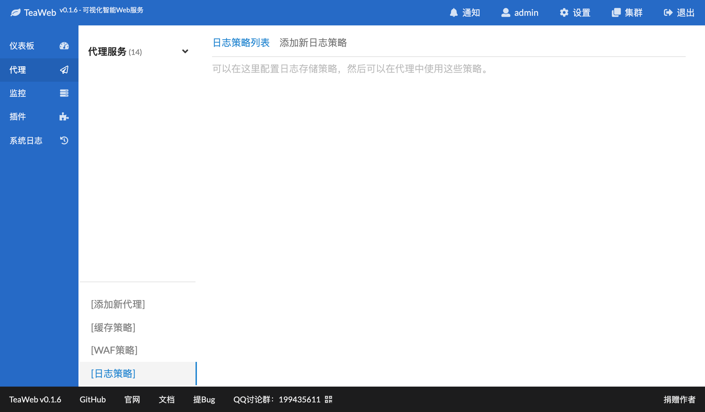
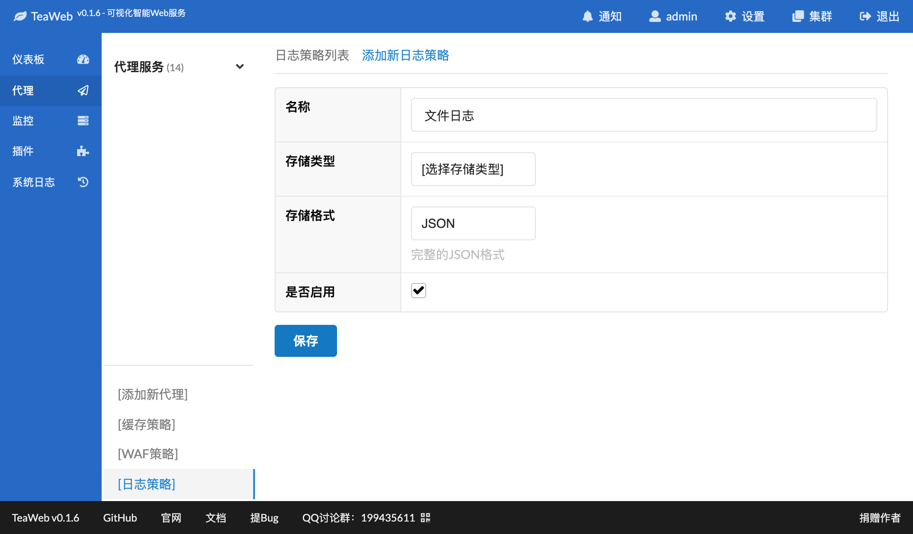
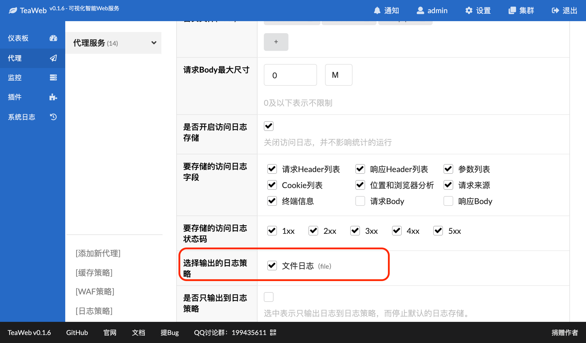
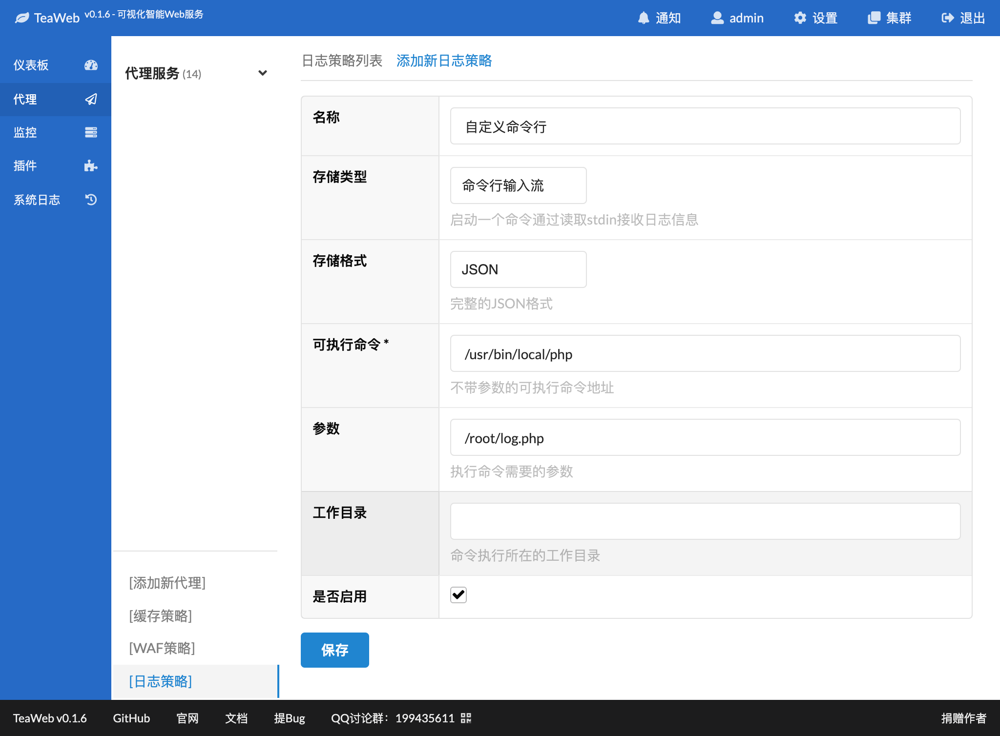

# 日志存储策略
## 添加
可以在代理界面左下角菜单中点击"日志策略"进入策略列表：

点击"添加新日志策略"：

其中，可以选择你想要的存储类型：
* `文件` - 可以将日志输出到一个或一组文件中
* `ElasticSearch` - 可以将日志输出到ElasticSearch中
* `MySQL` - 可以将日志输出到MySQL的一个或一组表中
* `TCP Socket` - 可以将日志输出到TCP Socket中，这样你就可以自己写一个TCP服务来接收这些日志
* `Syslog` - 可以将日志通过输出到syslog中，只有在Linux下可以使用，在v0.1.9中加入
* `命令行输入流` - 可以将日志输出到一个命令的输入流中（`stdin`），这样你可以通过读取输入流来接收这些日志

如果使用了模板，可以在这里查看支持的[模板变量](Index.md#模板变量)。

填写完相关信息，点底部的"保存"按钮即可保存。

## 使用
可以在代理服务或路径规则中使用这个日志策略：

如上图示，勾选并保存即可。

## 命令输入流示例
### 使用PHP读取日志
写一个`log.php`放在当前用户可以访问的一个目录下，比如`/root/log.php`，并保证有可执行权限，然后写入内容：
~~~php
<?php

// test command storage

// open access log file we want to write logs
$fp = fopen("/tmp/teaweb-command-storage.log", "a+");

// read access logs from stdin
$stdin = fopen("php://stdin", "r");
while(true) {
    if (feof($stdin)) {
        break;
    }
    $line = fgets($stdin);

    // write to access log file
    fwrite($fp, $line);
}

// close file pointers
fclose($fp);
fclose($stdin);

?>
~~~

然后配置日志策略：

其中：
* `存储类型` - 选择"命令行输入流"
* `存储格式` - 可以选JSON或者是一个字符串模板
* `可执行命令` - 这里是你服务器上已经安装的命令
* `参数` - 执行命令附加的参数
* `工作目录` - 执行命令时所在的目录，通常可以不填

### 使用Shell读取日志
相关的命令为：
~~~bash
#!/usr/bin/env bash

while read line
do
  echo "$line" >> /var/log/teaweb-accesslog
done
~~~

你也可以修改其中的日志输出，改成通过TCP或者UDP发送等。