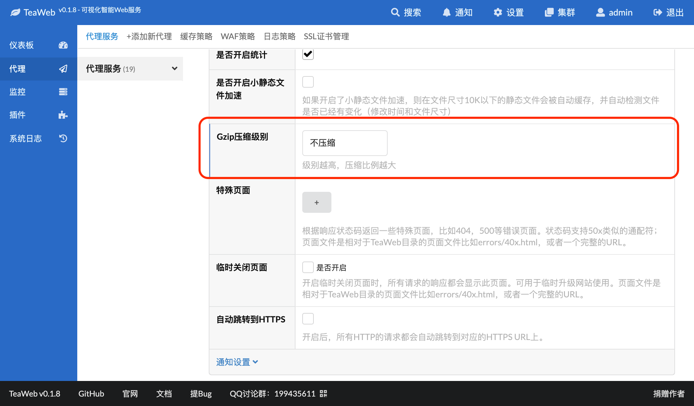
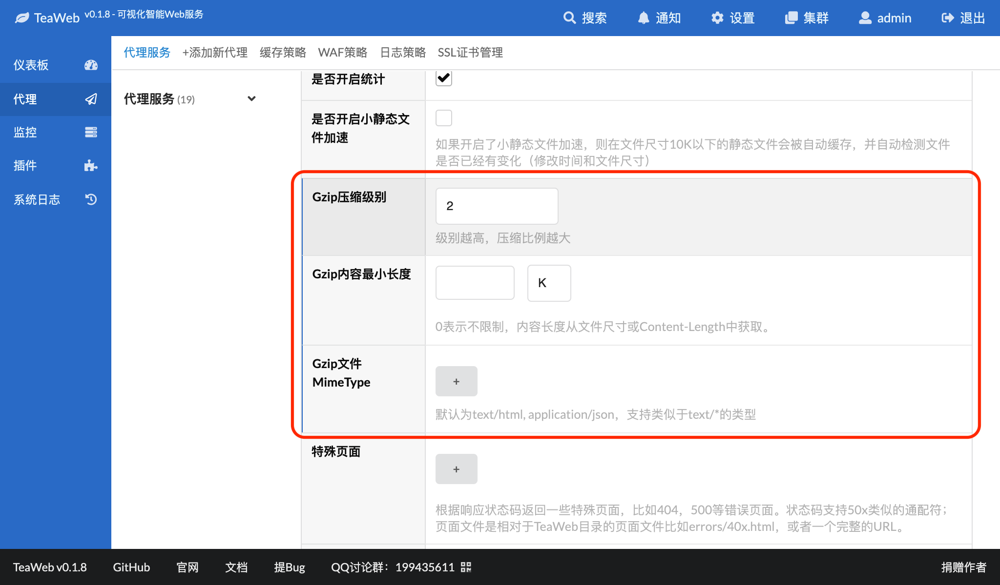
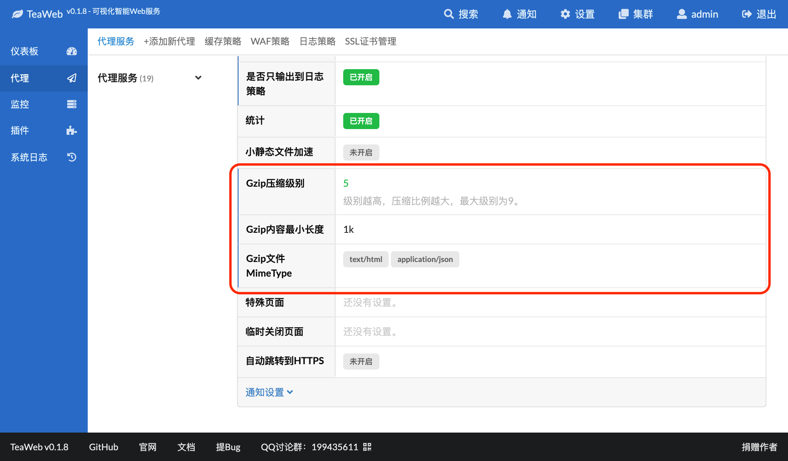

# Gzip
可以在代理服务中或者单个路径规则中设置Gzip压缩，以便于节省服务器输出内容的带宽。

以在代理服务中设置Gzip为例，在某个代理服务--"设置"--"基本信息"--"修改"--"更多选项"中可以找到"Gzip压缩级别"设置：

默认是"不压缩"，可以点开选择压缩级别，从1-9，级别越大压缩比例越大，当然消耗的CPU也会越大。

选择后出现以下界面：

其中：
* `Gzip内容最小长度` - Gzip需要压缩的内容的最小长度，也即当响应内容达到这个长度的时候才会启动Gzip压缩，0表示不限制，内容长度从文件尺寸或Content-Length中获取；
* `Gzip文件MimeType` - 支持Gzip的文件的类型，默认为`text/html`、`application/json`，也支持类似于`text/*`的类型说明。通常只有文本文件需要压缩。

假如我们把级别设置为5、`Gzip内容最小长度`设置为1k，保存后的信息为：

然后按照提示重启服务即可生效。