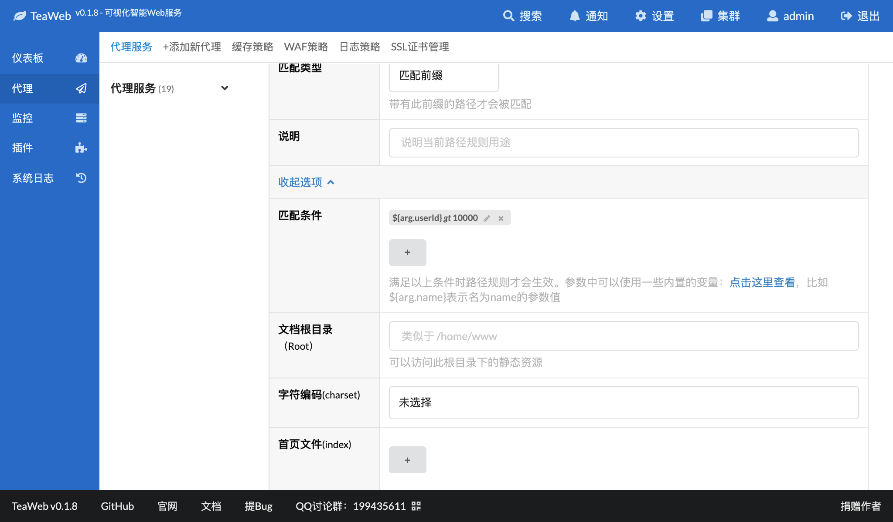

# 匹配条件
匹配条件是TeaWeb中一个重要的组件，它是对决定某个HTTP请求是否能够匹配的最灵活的方法。在路径规则、后端服务器分组、重写规则、缓存策略、WAF策略、日志存储策略等多个地方都可以使用匹配条件。

## 匹配条件的作用
匹配条件用来判断一个请求是否符合某个条件，比如在某个路径规则中设置了匹配条件，那么只有满足了这些匹配条件的请求才会映射到此路径规则，比如只有参数中`userId`大于`10000`的才能访问`/user`路径，就可以先定义一个路径规则`/user`，然后定义一个匹配条件：

点击"确认添加"变成：

保存后，下面两个URL就有不同的结果：
~~~
/user?userId=1234  # 不匹配此路径规则
/user?userId=12345 # 因为12345大于10000，所以匹配此路径规则
~~~

通过这个示例可以看出，匹配条件可以将不同用户的请求分配到不同的路径规则上。同样的，重写规则、缓存策略等等都可以利用匹配条件来筛选请求。

## 匹配条件的组成
单个匹配条件有三部分组成：
* `参数` - 被匹配的参数值，通常是使用[内置的变量](Variables.md)；
* `操作符` - 同对比值可以执行的操作，每个操作符都有一个代号，比如`大于`代号是`gt`，用来简化匹配条件的表述；
* `对比值` - 通过操作符，来将参数值和对比值进行对比，如果对比通过，则认为请求可以匹配；否则请求不匹配，不再继续。

通常我们使用`参数 操作符代号 对比值`来表述一个匹配条件，比如：
~~~
${arg.userId} gt 10000
~~~

## 操作符
以下逐个说明每个操作符的作用。

### 正则表达式匹配 `regexp`
判断是否正则表达式匹配，支持的正则表达式语法可以 [参考这里](../regexp/Regexp.md)。

示例：
* 匹配URL扩展名是`jpg、png、gif`的请求
  * 参数：`${requestPath}`
  * 操作符：正则表达式匹配
  * 对比值：`(?i)\.(jpg|png|gif)$` ，其中`(?i)`表示不区分大小写
* 匹配手机上的浏览器上的请求：
  * 参数：`${userAgent}`
  * 操作符：正则表达式匹配
  * 对比值：`(?i)(iPhone|iPad|android)`  

### 正则表达式不匹配 `not regexp`
判断是否正则表达式不匹配，支持的正则表达式语法可以 [参考这里](../regexp/Regexp.md)。

示例：
* 匹配请求来源不是域名`teaos.cn`的请求，可以用来实现简单的防盗链：
  * 参数：`${referer}`
  * 操作符：正则表达式不匹配
  * 对比值：`(http|https)://teaos\.cn`

### 字符串等于 `eq`
使用字符串对比参数值是否相等于某个值。

示例：
* 匹配URL参数中含有`name=liu`的所有请求：
  * 参数：`${arg.name}`
  * 操作符：字符串等于
  * 对比值：`liu`
* 匹配所有`POST`方法的请求：
  * 参数：`${requestMethod}`
  * 操作符：字符串等于
  * 对比值：`POST`

### 字符串前缀 `prefix`
参数值包含某个前缀。

示例：
* 匹配URL中`/h5`相关的请求，这样可以区分H5和PC网站：
  * 参数：`${requestPath}`
  * 操作符：字符串前缀
  * 对比值：`/h5`

### 字符串后缀 `suffix`
参数值包含某个后缀。

示例：
* 匹配URL中所有以`.do`结尾的请求，这样可以对一些动态的请求执行一些动作：
  * 参数：`${requestPath}`
  * 操作符：字符串后缀
  * 对比值：`.do`

### 字符串包含 `contains`
参数值包含另外一个字符串。

示例：
* 匹配URL中包含某个域名的请求：
  * 参数：`${host}`
  * 操作符：字符串包含
  * 对鼻子：`teaos.cn`

### 字符串不包含 `not contains`
参数值不包含另外一个字符串。

示例：
* 匹配URL中不包含某个域名的请求：
  * 参数：`${host}`
  * 操作符：字符串包含
  * 对鼻子：`rockmongo.com`

### 字符串不等于 `not`
使用字符串对比参数值是否不相等于某个值。

示例：
* 判断URL中的`type`参数不等于`book`，由此可以根据某个参数值的不同进行不同的动作：
   * 参数：`${arg.type}`
   * 操作符：字符串不等于
   * 对比值：`book`

### 在列表中 `in`
v0.1.8，判断参数值在某个列表中。

示例：
* 判断URL中的`lang`参数是`golang`、`php`、`python`中的一种，由此可以根据某个参数值的不同进行不同的动作：
   * 参数：`${arg.lang}`
   * 操作符：在列表中
   * 对比值：`["golang", "php", "python"]`

### 不在列表中 `not in`
v0.1.8，判断参数值不在某个列表中。

示例：
* 判断URL中的`lang`参数不是`java`、`ruby`中的一种，由此可以根据某个参数值的不同进行不同的动作：
   * 参数：`${arg.lang}`
   * 操作符：不在列表中
   * 对比值：`["java", "ruby"]`

### 扩展名 `file ext`
v0.1.8，取某个参数值的扩展名，然后判断小写的扩展名（不带点）在某个列表中。

示例：
* 判断扩展名为`jpg`、`jpeg`、`png`、`gif`、`webp`中的一种：
   * 参数：`${requestPath}` 用来取扩展名的参数
   * 操作符：扩展名
   * 对比值：`["jpg", "jpeg", "png", "gif", "webp"]`

### MimeType `mime type`
v0.1.8，判断MimeType在某个列表中，支持类似于`image/*`的语法。

### 版本号范围 `version range`
v0.1.8，判断版本号在某个范围内，格式为version1,version2。

示例：
* 判断URL中的`version=xxx`参数中版本号不小于`1.0.1`：
   * 参数：`${arg.version}` 
   * 操作符：版本号范围
   * 对比值：`1.0.1,`
* 判断URL中的`version=xxx`参数中版本号不大于`1.0.5`：
   * 参数：`${arg.version}` 
   * 操作符：版本号范围
   * 对比值：`,1.0.5`
* 判断URL中的`version=xxx`参数中版本号在`1.0.1`和`1.0.5`之间：
   * 参数：`${arg.version}` 
   * 操作符：版本号范围
   * 对比值：`1.0.1,1.0.5`      

### 整数等于 `eq int`
v0.1.8，将参数转换为整数数字后进行对比。

示例：
* 判断URL中的`typeId`参数等于`1`：
   * 参数：`${arg.typeId}`
   * 操作符：整数等于
   * 对比值：`1`

### 浮点数等于 `eq float`
v0.1.8，将参数转换为可以有小数的浮点数字进行对比。

示例：
* 判断URL中的`width`桉树等于`1024`：
   * 参数：`${arg.width}`
   * 操作符：浮点数等于
   * 对比值：`1024`

### 数字大于 `gt`
将参数转换为数字进行对比。

示例：
* 判断URL中的`userId`参数大于`10000`：
   * 参数：`${arg.userId}`
   * 操作符：数字大于
   * 对比值：`10000`

### 数字大于等于 `gte`
将参数转换为数字进行对比。

示例：
* 判断URL中的`userId`参数大于等于`10000`：
   * 参数：`${arg.userId}`
   * 操作符：数字大于等于
   * 对比值：`10000`

### 数字小于 `lt`
将参数转换为数字进行对比。

示例：
* 判断URL中的`userId`参数小于`10000`：
   * 参数：`${arg.userId}`
   * 操作符：数字小于
   * 对比值：`10000`

### 数字小于等于 `lte`
将参数转换为数字进行对比。

示例：
* 判断URL中的`userId`参数小于等于`10000`：
   * 参数：`${arg.userId}`
   * 操作符：数字小于等于
   * 对比值：`10000`

### IP等于 `eq ip`
v0.1.8，将参数转换为IP进行对比。

示例：
* 判断客户端IP为`127.0.0.1`：
  * 参数：`${remoteAddr}`
  * 操作符：IP等于
  * 对比值：`127.0.0.1`

### IP大于 `gt ip`
v0.1.8，将参数转换为IP进行对比。

示例：
* 判断客户端IP大于`192.168.1.100`：
  * 参数：`${remoteAddr}`
  * 操作符：IP大于
  * 对比值：`192.168.1.100`

### IP大于等于 `gte ip`
v0.1.8，将参数转换为IP进行对比。

示例：
* 判断客户端IP大于等于`192.168.1.100`：
  * 参数：`${remoteAddr}`
  * 操作符：IP大于等于
  * 对比值：`192.168.1.100`

### IP小于 `lt ip`
v0.1.8，将参数转换为IP进行对比。

示例：
* 判断客户端IP小于`192.168.1.100`：
  * 参数：`${remoteAddr}`
  * 操作符：IP小于
  * 对比值：`192.168.1.100`

### IP小于等于 `lte ip`
v0.1.8，将参数转换为IP进行对比。

示例：
* 判断客户端IP小于等于`192.168.1.100`：
  * 参数：`${remoteAddr}`
  * 操作符：IP小于等于
  * 对比值：`192.168.1.100`

### IP范围 `ip range`
v0.1.8，IP在某个范围之内，范围格式可以是英文逗号分隔的ip1,ip2，或者CIDR格式的ip/bits。

示例：
* 判断客户端IP在`192.168.1.100`和`192.168.2.1`之间：
  * 参数：`${remoteAddr}`
  * 操作符：IP范围
  * 对比值：`192.168.1.100,192.168.2.1`
* 判断客户端IP不小于`192.168.1.100`：
    * 参数：`${remoteAddr}`
    * 操作符：IP范围
    * 对比值：`192.168.1.100,`
* 判断客户端IP不大于`192.168.2.1`：
    * 参数：`${remoteAddr}`
    * 操作符：IP范围
    * 对比值：`,192.168.2.1`    
* 判断客户端IP在`192.168.1.100/24`（CIDR形式的IP范围）内：
  * 参数：`${remoteAddr}`
  * 操作符：IP范围
  * 对比值：`192.168.1.100/24`   
  