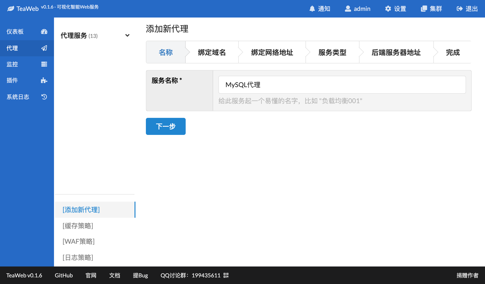
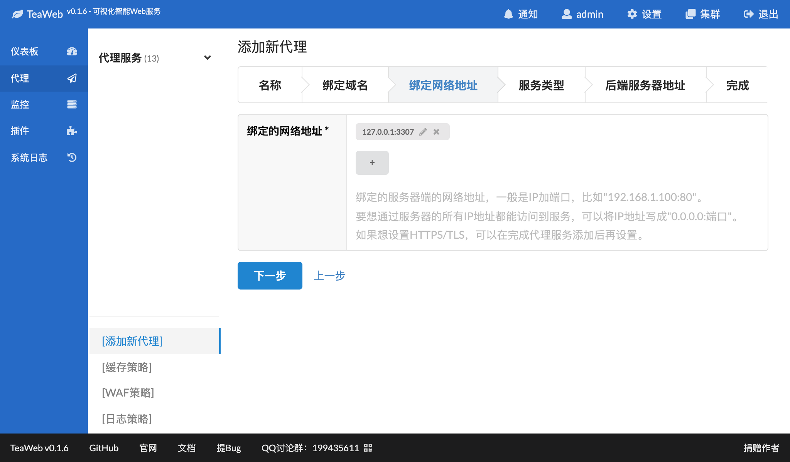
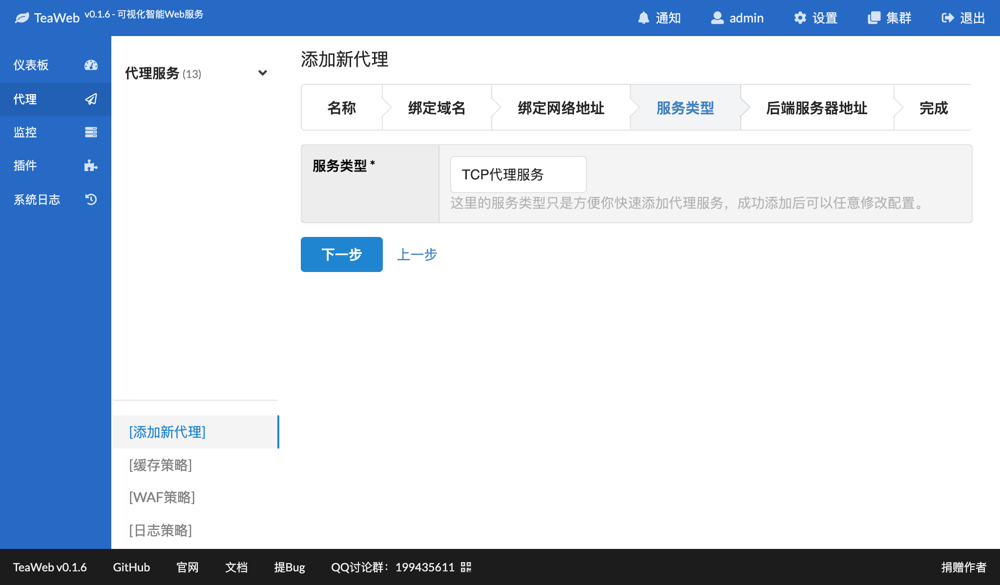
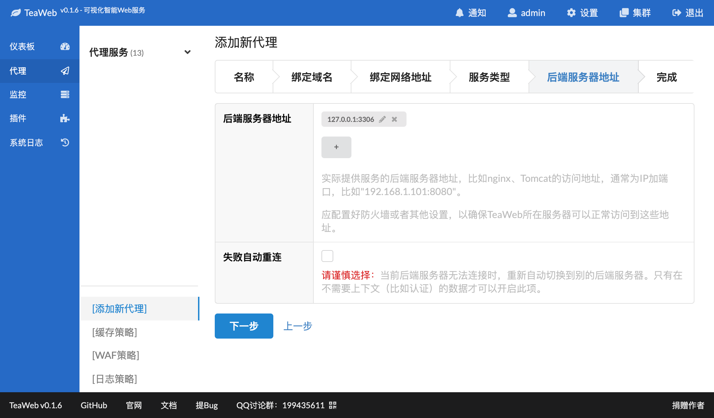
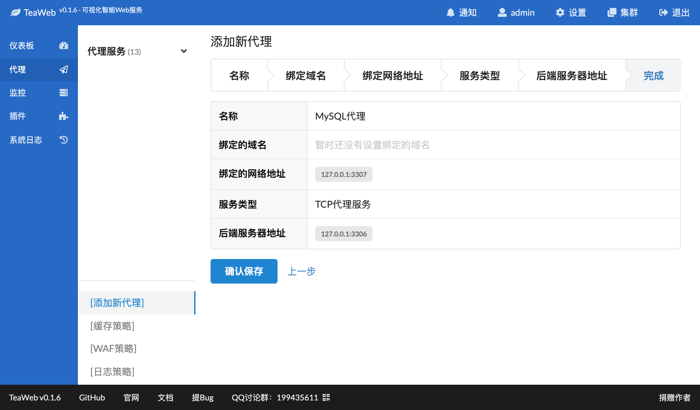

# TCP代理
从v0.1.6开始支持TCP代理。

## 添加TCP代理
以下以添加一个MySQL代理为例，演示如何添加TCP代理。

可以在左下角菜单"添加新代理"中添加TCP代理：

域名可以跳过，然后在绑定的网络地址中填写一个供用户访问的网络地址（通常是IP+端口）：

在服务类型中选择"TCP代理服务"：

在后端服务器地址中添加一个真实的服务地址，比如这个例子的MySQL地址--"127.0.0.1:3306"：

当然实际应用中，你可以添加更多的后端服务地址，以便于实现负载均衡或者失败重试。

然后完成信息确认之后即可：

按照界面提示的重启服务后即可访问：
~~~
127.0.0.1:3307
~~~
实际上访问的是`127.0.0.1:3306`。

### 使用MySQL客户端测试
因为我们在这个例子中添加的是MySQL代理，所以可以使用MySQL客户端命令测试：
~~~bash
bin/mysql -uroot -h127.0.0.1 -P3307 -p
Enter password:
~~~

输入正确的MySQL连接密码即可进入类似以下的提示：
~~~
Welcome to the MySQL monitor.  Commands end with ; or \g.
Your MySQL connection id is 11
Server version: 5.6.23-log MySQL Community Server (GPL)
...
~~~
说明我们的代理配置正确了。